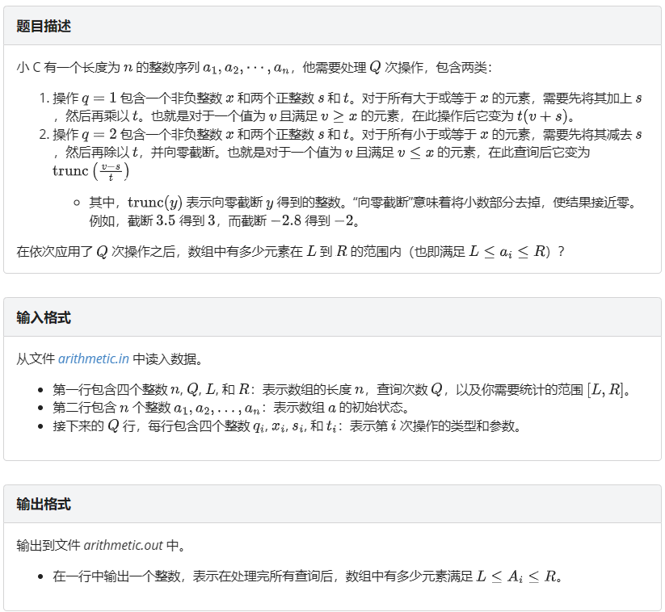
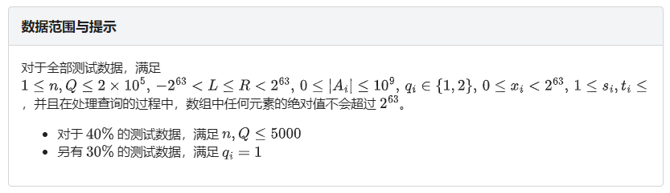

<link rel="shortcut icon" href="/favicon.ico" type="image/x-icon">
<script>
	document.body.parentElement.lang = "zh-cn";
</script>
<script src="/katex/katex.min.js"></script>
<script src="/katex/contrib/auto-render.min.js"></script>
<script src="/codecopy/clipboard.js"></script>
<script defer type="module">
	import { marked } from '../marked.js';
	function showLoader() {
		const loader = document.getElementById('loader');
		loader.style.display = 'flex';
		loader.style.opacity = '1';
	}
	function fadeOutLoader() {
		const loader = document.getElementById('loader');
		loader.style.opacity = '0';
		setTimeout(() => {
			loader.style.display = 'none';
		}, 500);
	}
	// 初始加载检测
	document.addEventListener('DOMContentLoaded', () => {
		// 基础DOM加载完成
		fadeOutLoader();
		// 检测动态DOM更新
		const observer = new MutationObserver((mutations) => {
			if (document.querySelector('[data-loading]')) {
				showLoader();
			} else {
				fadeOutLoader();
			}
		});
		observer.observe(document.body, {
			childList: true,
			subtree: true,
			attributes: true
		});
	});
	showLoader();
	window.myloader = { show: showLoader, hide: fadeOutLoader };
	if (true)
	{
		renderMathInElement(document.body, {
			delimiters: [
				{ left: '$$', right: '$$', display: true },
				{ left: '$', right: '$', display: false },
			],
		});
		function fun() {
			// 获取所有的 <pre><code>...</code></pre> 元素
			var preElements = document.querySelectorAll('pre code');
			// 遍历这些元素
			preElements.forEach(function (codeElement) {
				// 创建复制按钮
				var button = document.createElement('button');
				button.textContent = '复制';
				button.classList.add('codecopy-btn'); // 添加类以便样式化
				// 将按钮添加到 code 元素的父元素（即 pre 元素）中
				var div = document.createElement('div');
				div.style = "width:100%;position: relative;";
				div.appendChild(button);
				codeElement.before(div);
				codeElement.parentElement.classList.add("hljs-prt");
				let x = codeElement;
				// 使用 Clipboard.js 初始化复制功能
				let clipboard = new ClipboardJS(button, {
					text: function (trigger) {
						// 返回要复制的文本
						return x.innerText.replace(/\n\n/g, "\n");
					}
				});
				clipboard.on('success', function (e) {
					console.log('复制成功！', e);
					// 可以在这里修改按钮的文本或样式来表示成功
					e.clearSelection(); // 清除选区
					e.trigger.textContent = '复制成功';
					setTimeout(() => {
						e.trigger.textContent = '复制';
					}, 500);
				});
				clipboard.on('error', function (e) {
					console.error('复制失败！', e);
					// 可以在这里处理错误
					e.trigger.textContent = '复制失败';
					setTimeout(() => {
						e.trigger.textContent = '复制';
					}, 500);
				});
			});
		}
		fun();
		fadeOutLoader();
		window.myloader.hide();
	}
</script>

<div class="loader-overlay" id="loader" style="display: flex;opacity: 1;z-index: 100000000;">
		<div class="loader" style="
    display: flex;
    opacity: 1;
"></div>
		<div class="loader" style="
    position: fixed;
    opacity: 1;
    width: 9.5em;
    height: 9.5em;
    opacity: 1 !important;
    background: white;
    box-shadow: inset 0 0 0.75em rgba(0, 0, 0, 0.1);
"></div>
		<div style="
    position: fixed;
    opacity: 1;
    z-index:999999999;
">loading...</div>
	</div>
# [NOIP十三连测第十三套 ] --T1--加减乘除





可以发现操作以后数的相对位置不会变化。设 `work(x)` 表示 $x$ 经过所有操作以后的新值，可以二分查找。

```cpp
#include<bits/stdc++.h>
typedef int int32;
#define int long long
using namespace std;
const int N = 2e5 + 5;
int n, q, L, R, ans, a[N], opt[N], x[N], s[N], t[N];
int work(int x)
{
	for (int i = 1; i <= q; i++)
		if (opt[i] == 1)
			x = (x >= ::x[i] ? (x + s[i]) * t[i] : x);
		else
			x = (x <= ::x[i] ? trunc((x - s[i]) * 1.00 / t[i]) : x);
	return x;
}
int helpl()
{
	int l = 0, r = n + 1;
	while (l + 1 < r)
	{
		int mid = (l + r) >> 1;
		if (work(a[mid]) >= L)
			r = mid;
		else
			l = mid;
	}
	return r;
}
int helpr()
{
	int l = 0, r = n + 1;
	while (l + 1 < r)
	{
		int mid = (l + r) >> 1;
		if (work(a[mid]) <= R)
			l = mid;
		else
			r = mid;
	}
	return l;
}
signed main()
{
	ios::sync_with_stdio(0);
	cin.tie(0), cout.tie(0);
	//freopen("arithmetic.in", "r", stdin);
	//freopen("arithmetic.out", "w", stdout);
	cin >> n >> q >> L >> R;
	for (int i = 1; i <= n; i++)
		cin >> a[i];
	for (int i = 1; i <= q; i++)
		cin >> opt[i] >> x[i] >> s[i] >> t[i];
	sort(a + 1, a + 1 + n);
	cout << max(0ll, helpr() - helpl() + 1);
	return 0;
}
```

# \[NOIP十三连测第十三套 \] --T2--图书管理

考虑计算每个中位数 $p_i$ 的贡献。对于 $p_j \gt p_i$ 令 $a_j = 1$，对于 $p_j \lt p_i$ 令 $a_j = -1$，问题变为有多个区间 $[l,r]$ 满足 $l \le i \le r$，且 $\sum^r_{j=l}a_j=0$。从 $i$ 往左扫描并累计和 $s_j=\sum^i_{k=j}a_k=0$，使用一个数组背景每种 $s_j$ 的取值个数。类似的从 $i$ 往右累计 $t_j=\sum^i_{k=j}a_k=0$，并且询问取值为 $-t_j$ 的 $s$ 的数量。

- 时间复杂度 $O(n^2)$。
